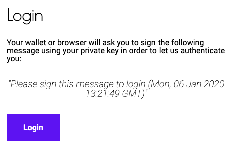

Use the `login` command to authenticate with the solUI backend server.

_Note: This is only required if you wish to publish a UI to the solUI cloud._

```shell
solui login
```

This will trigger a browser window to open to the https://solui.dev/login, asking you to
login. Logging into the solUI backend requires signing a message with your private Ethereum key.
We recommend having Metamask setup in your browser.



Once you have logged in the terminal command (above) will finish, and
an authentication token will be written to `<user home directory>/.solui`.

If you're publishing a UI as part of your CI build then you can
pre-populate this file with an authentication token in order to publish to the solUI cloud.
