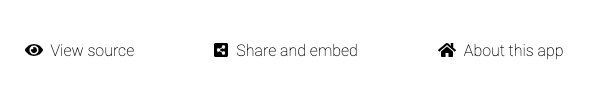

Every solUI Dapp has a menu at the bottom:

These do the following:

* `View source` - view the Dapp spec as well as contract artifacts JSON
* `Share and embed` - get the URL for sharing this Dapp with others or embedding within a webpage
* `About this app` - visit the homepage for this app (corresponds to the `aboutUrl` property in the [Dapp spec](../../Specification))

