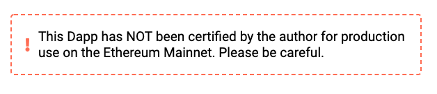

A Dapp author has to explicitly mark their Dapp as ready for production use on the Ethereum Mainnet.

Otherwise, by default, when running against the Mainnet the rendered Dapp UI will display a warning on every
panel which looks like this:

This is intended as a safety measure to protect users.

Marking a Dapp as ready for production use involves setting the `production` flag in the [specification](../../Specification).
