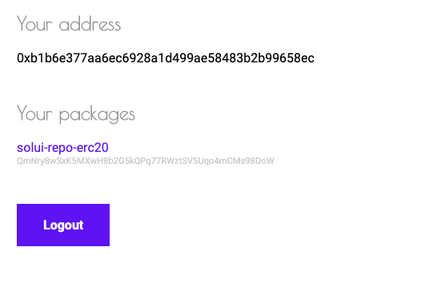

In order to publish your UI to the solUI cloud you will first need to authenticate with our backend.
Authentication is required so that we can carefully control access to our cloud IPFS cluster. Once your
data is published you can of course easily replicate it elsewhere using its unique _CID (content hash)_.

Authentication is performed by vising https://solui.dev/login and then signing a login message using your
Ethereum private key:

You do not need to sign or send a transaction or interact with the blockchain in any other way. We recommend
having Metamask setup in your normal web browser for authentication to work.

Once you're authenticated you will be redirected to your solUI dashboard, where you can
see all the packages you've published to the solUI cloud:

