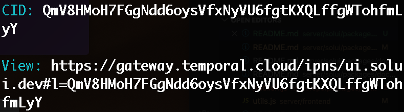

All UIs is published to and served from [IPFS](https://ipfs.io), a peer-to-peer decentralized network.
This ensures that your UI will be available as long as at least one IPFS node has a copy of it.

## Cloud IPFS

By default your UI spec and associated contract artifacts will be published via our backend server to our
public IPFS cloud (hosted by [Temporal](https://temporal.cloud/)). Our IPFS node will ensure your UI always
remains accessible even if other nodes stop hosting it. Another benefit is that it saves you from having to
host and manage an IPFS node yourself.

Publishing is done quickly and easily [via the CLI](../../CommandLine/Publish). Once successful, a unique
_content hash_ is returned - this is the hash for your UI as returned by IPFS and can be used to access
your published data.

For example, after successfully [publishing  you will receive both a _CID (content hash)_ and a URL for viewing your UI, e.g:



The viewing URL consists of the IPFS URL of the solUI viewer (a self-contained single-page app which is shared among all
published UIs) and a URL hash parameter specifying the CID of the UI to render.

_Note: publishing to our backend involves an [authentication step](../Authentication)_.

## Custom/local IPFS

You can of course choose to publish your UI to your own IPFS node hosted locally or elsewhere. No communication or authentication with our backend server is
needed if publishing to your own IPFS node; however **it is your responsibility to manage your node and ensure that your UI remains accessible**.

You can still use our cloud hosted viewer to render your UI by simplifying specifying the full URL of your UI in the hash parameter.
For example, if your UI is hosted at https://ipfs.yourdomain.com/QmV8HMoH7FGgNdd6oysVfxNyVU6fgtKXQLffgWTohfmLyY then render it using:

```
https://gateway.temporal.cloud/ipns/ui.solui.dev/#l=https://ipfs.yourdomain.com/QmV8HMoH7FGgNdd6oysVfxNyVU6fgtKXQLffgWTohfmLyY
```


