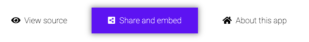
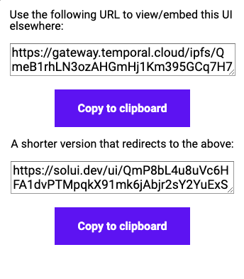

Published Dapps can be embedded in any webpage as using an `iframe` HTML tag. For example, if the content hash of your published Dapp is `QmV8HMoH7FGgNdd6oysVfxNyVU6fgtKXQLffgWTohfmLyY` then embed it in an existing page using:

```html
<iframe src="https://gateway.pinata.cloud/ipns/ui.solui.dev/#l=QmV8HMoH7FGgNdd6oysVfxNyVU6fgtKXQLffgWTohfmLyY" width="800" height="600" />
```

Note that the `width` and `height` parameters can be set however you see fit. The solUI renderer will auto-fit the content as best as it can. All other normal `iframe` HTML attributes can also be customized you wish.

When viewing an embedded solUI interface you can grab it embedding URL via share and embed button:



The _View source_ link will allow you to view the full JSON for both the spec and the contract artifacts.

## Short URLs

When publishing to the solUI cloud the CLI will also output a "shorter" friendlier URL that redirects to the IFPS one, e.g:

```
https://solui.dev/ui/QmV8HMoH7FGgNdd6oysVfxNyVU6fgtKXQLffgWTohfmLyY
```

If you view your Dapp via this shorter URL then the sharing/embedding interface will also show this:



## Customize styling

The default colour scheme for the Dapp components can be customized on a per-embedded-instance basis. For example, to replace the default gradient background with a plain `black` colour, append `&layoutBgColor=black` to the view URL:

```
https://gateway.pinata.cloud/ipns/ui.solui.dev/#l=QmV8HMoH7FGgNdd6oysVfxNyVU6fgtKXQLffgWTohfmLyY&layoutBgColor=black
```

When using the shorter embed URL you need to specify them as query arguments:

```
https://solui.dev/ui/QmV8HMoH7FGgNdd6oysVfxNyVU6fgtKXQLffgWTohfmLyY?layoutBgColor=black
```

Until a more robust styling mechanism is implemented you can currently use this mechanism to override any of the colours in [the default theme](https://github.com/solui/solui/blob/master/packages/styles/src/themes/1.js).


