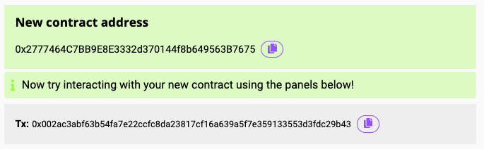
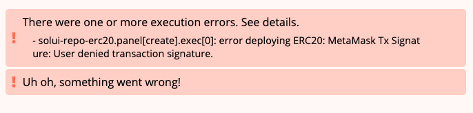

Execution tasks define what contract methods get called with what arguments.

If a [panel](../Panels) defines more than one execution task they are
executed in _sequence_, not parallel.
This allows for the output of an earlier task to be re-used as the input argument of a later task.

## Structure

```js
{
  ...,
  "panels": [
    {
      ...,
      "execs": [
        {
          "type": "...",
          "contract": "...",
          "address": "...",
          "method": "...",
          "args": { ... },
          "transferAmount": "...",
          "saveResultAsInput": "..."
          "successMessage": "...",
          "failureMessage": "..."
        }
      ]
    }
  ]
}
```

## Reference

**type**

The type of contract call to make. Can be one of:

* `deploy` - deploy a contract. _Note: The `method` property is
ignored in this case_.
* `call` - call a read-only method on a contract without creating a
transaction (equivalent to [eth_call](https://github.com/ethereum/wiki/wiki/JSON-RPC#eth_call)).
* `send` - call a method on a contract by creating a
transaction (equivalent to [eth_sendTransaction](https://github.com/ethereum/wiki/wiki/JSON-RPC#eth_call)).

Example:

```js
{
  "type": "send"
}
```

**contract**

The name of the contract, present in the list of [contract artifacts](../../CommandLine/View).

Example:

```js
{
  "name": "ERC20"
}
```

**address**

The on-chain address of the contract, specified as one of:

  * Name of a panel [input field](../Inputs).
  * A named [constant](../Constants).
  * An [environment variable](../EnvVars).
  * The result of a previous execution task (see `saveResultAs` below).
  * A fixed value.

Example (address is specified as a user input field):

```js
{
  "inputs": [
    { name: "contractAddress", ... },
    ...
  ],
  "execs": [
    {
      ...,
      "address": "@input[contractAddress]"
    }
  ]
}
```


Example (referring to the first item in [list input](../ListInputs) field):

```js
{
  "inputs": [
    { name: "premiumPayments", type: "int[]", ... },
    ...
  ],
  "execs": [
    {
      ...,
      "address": "@input[premiumPayments][0]"
    }
  ]
}
```

Example (address is specified as a named constant):

```js
{
  "execs": [
    {
      ...,
      "address": "@constant[contractAddress]"
    }
  ]
}
```

Example (address is specified as result of earlier task):

```js
{
  "execs": [
    /* this gets executed first */
    {
      ...,
      "saveResultAsInput": "contractAddress"
    },
    /* this gets executed second */
    {
      ...,
      "address": "@input[contractAddress]"
    }
  ]
}
```

**method**

The method to call on the contract. The method must be externally callable.

Example:

```js
{
  "method": "transfer"
}
```

_Note: If execution `type` equals `deploy` then this property is ignored_.

**args** _(optional)_

The arguments to pass to the contract method.

This is specified as key-value pairs, where the key is the name of contract
method argument and corresponding value is one of:

  * Name of a panel [input field](../Inputs).
  * A named [constant](../Constants).
  * An [environment variable](../EnvVars).
  * The named result of a previous execution task (see `saveResultAs` below).
  * A fixed value.

Example:

```js
{
  "inputs": [
    { name: "name", ... },
    { name: "symbol", ... },
    { name: "initialSupply", ... }
  ],
  "execs": [
   {
     "type": "deploy",
     "contract": "ERC20",
     "args": {
       "_name": "@constant[tokenName]",
       "_symbol": "@input[symbol]",
       "_initialSupply": "1000000"
     }
   }
  ]
}
```

Example using an environment variable:

```js
{
  "execs": [
    {
      "type": "call",
      "method": "balanceOf",
      "args": {
        "_address": "@env[account]",
      }
      ...,
    }
  ]
}
```

Example mapping from result of previous execution:

```js
{
  "execs": [
    {
      "type": "deploy",
      ...,
      "saveResultAsInput": "newContractAddress",
    },
    {
      "type": "send",
      "method": "setTokenContract",
      "args": {
        "_address": "@input[newContractAddress]",
      }
      ...,
    }
  ]
}
```

**transferAmount** _(optional)_

The amount of ETH to send along with a transaction (equivalent to [msg.value](https://ethereum.stackexchange.com/questions/43362/what-is-msg-value)).

This property only applies when the execution `type` is `send` and should only be used when calling [payable](https://medium.com/@rsripathi781/6-payable-functions-in-solidity-smartcontract-ethereum-d2535e346dc1) functions.

It can be specified as one of:

  * Name of a panel [input field](../Inputs).
  * A named [constant](../Constants).
  * An [environment variable](../EnvVars).
  * The result of a previous execution task (see `saveResultAs` below).
  * A fixed value.

_Note: The processor will automatically convert the resolved value to its final hexadecimal representation prior to sending the transaction_.

Example (specified as a user input field):

```js
{
  "inputs": [
    { name: "amount", ... },
    ...
  ],
  "execs": [
    {
      ...,
      "transferAmount": "@input[amount]"
    }
  ]
}
```

**saveResultAsInput** _(optional)_

Save the result of the execution as a named variable to used as an input later
on.

Example:

```js
{
  "execs": [
    {
      "type": "call",
      ...,
      "saveResultAsInput": "currentBalance",
    },
    {
      "type": "send",
      "method": "transfer",
      "args": {
        "_amount": "@input[currentBalance]",
      }
      ...,
    }
  ]
}
```

**successMessage** _(optional)_

A message to be shown to the user if the transaction succeeds. This property thus only applies to
contract execution tasks of types `deploy` and `send`.

Note that this message will be shown _in addition_ to what is normally shown.

Example:

```js
{
  "execs": [
    {
      "type": "deploy",
      "contract": "ERC20",
      "args": {
        "_name": "@input[name]",
        "_symbol": "@input[symbol]",
        "_initialSupply": "@input[initialSupply]"
      },
      "saveResultAsInput": "contractAddress",
      "successMessage": "Now try interacting with your new contract using the panels below!"
    }
  ]
}
```

The displayed message will look something like this:



**failureMessage** _(optional)_

A message to be shown to the user if the transaction fails. This property thus only applies to
contract execution tasks of types `deploy` and `send`.

Note that this message will be shown _in addition_ to what is normally shown.

Example:

```js
{
  "execs": [
    {
      "type": "deploy",
      "contract": "ERC20",
      "args": {
        "_name": "@input[name]",
        "_symbol": "@input[symbol]",
        "_initialSupply": "@input[initialSupply]"
      },
      "saveResultAsInput": "contractAddress",
      "failureMessage": "Uh oh, something went wrong!"
    }
  ]
}
```

The displayed message will look something like this:


