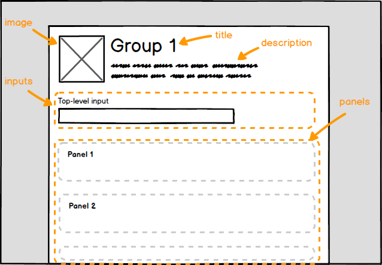

Groups are collection of user interface [panels](../Panels).



A panel group can have top-level [input fields](../Inputs) in order to pass
common input arguments to all of its [panels][Panels].

## Structure

```js
{
  ...,
  "groups": [
    {
      "id": "...",
      "title": "...",
      "description": "...",
      "image": { ... },
      "inputs": [ ... ],
      "panels": [ ... ],
    }
  ]
}
```

## Reference

**id**

This should be a human-readable and identifier for the panel group, e.g. `erc20-manager`. The supported characters are: `A-Z`, `a-z`, `0-9` and `-`. It must be between 3 and 32 characters in length.

This id must be unique amongst all the other panel groups in the spec.

Example:

```js
{
  "id": "deploy-token",
}
```

**title**

A user-friendly title for the panel group.  It must be between 3 and 256 characters in length.

Example:

```js
{
  "title": "Deploy a new token",
}
```

**description** _(optional)_

A user-friendly text-only description for the panel group. There is no character limit.

Example:

```js
{
  "description": "Configure and deploy a new ERC-20 token"
}
```

**image** _(optional)_

An image which appears to display alongside the panel group title.

```js
{
  "image": {
    "url": "https://url.to/groupIcon.png"
  }
}
```

Base-64 `data:` URLs are also supported:

```js
{
  "image": {
    "url": "data:image/gif;base64,R0lGO..."
  }
}
```

**inputs** _(optional)_

User [input fields](../Inputs) which define common input values for the [panels](../Panels) within the group.

```js
{
  "inputs": [
    { ... },
    { ... },
    ...,
  ]
}
```

**panels**

UI [panels](Panels) which make up the panel group.

```js
{
  "panels": [
    { ... },
    { ... },
    ...,
  ]
}
```
