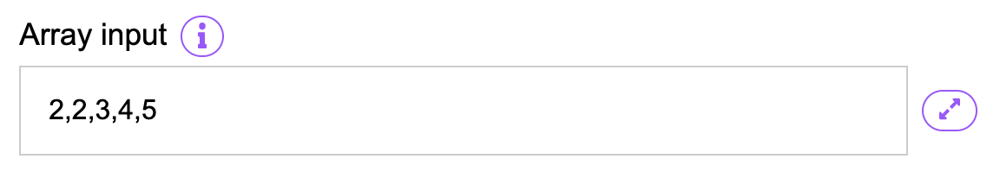
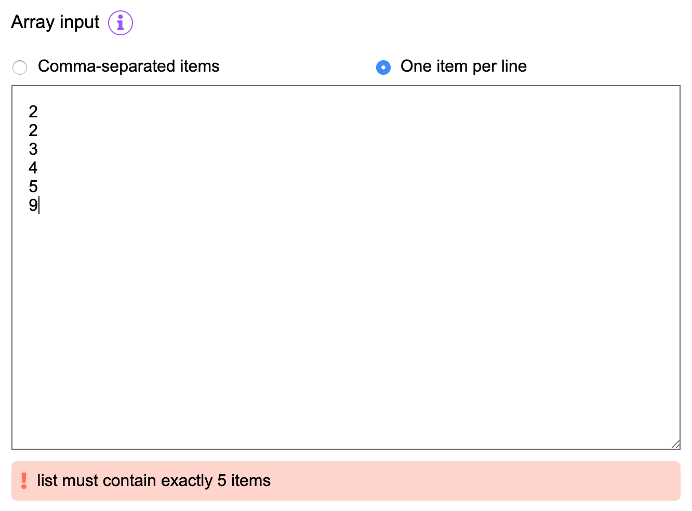
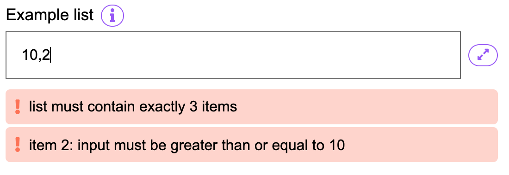

List inputs define fields which hold a list of items. They are specified by using of the following input types:

* `int[]`
* `bytes32[]`
* `address[]`

The UI will render a list input field as follows:



By default a list input accepts comma-separated input. However, an expanded input modal is always
available, through which one can choose to input items one-per-line or comma-separated and easily
switch between the two:



## Validation

The standard [validation](../InputValidation) rules also apply to list items.

For example, to specify a list of 3 numbers where each number must be between 10 and 20, configure
the input as follows:

```js
{
  "type": "int[]",
  "validation": [
    {
      /* list must contain exactly 3 items */
      "type": "listSize",
      "min": 3,
      "max": 3
    },
    {
      /* numbers must be between 10 and 20 */
      "type": "range",
      "min": 10,
      "max": 20
    }
  ]
}
```

Here is how the validation errors for this may typically look:



Another example: to configure a list of no more than 10 addresses where each address is a
contract address:

```js
{
  "type": "address[]",
  "validation": [
    {
      /* list must not contain more than 10 items */
      "type": "listSize",
      "max": 10
    },
    {
      /* addresses must be "contract" addresses */
      "type": "allowedTypes",
      "contract": true
    }
  ]
}
```
