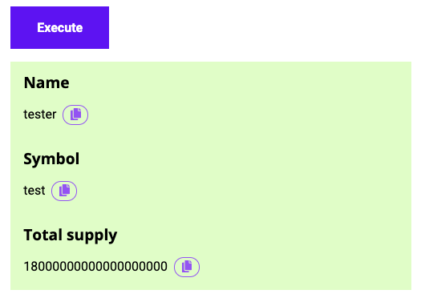
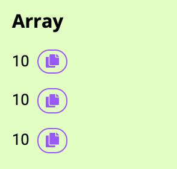
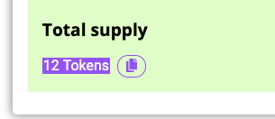

Outputs specify results to display to the user once panel has succesfully executed. If no outputs are defined then the Dapp will not display any results but will simply show a success status.



## Structure

```js
{
  ...,
  "panels": [
    {
      ...,
      "execs": [ ... ],
      "outputs": [
        {
          "title": "...",
          "type": "...",
          "value": "...",
          "scale": "...",
          "unit": "...",
        },
        ...
      ]
    }
  ]
}
```

Note that outputs are only displayed once all [Execution steps](../Execs) have been completed.

## Reference

**type**

The output type. This is to help the renderer figure out how best to display the output value. At present this must be one of:

* `address`
* `bool`
* `bytes32`
* `int`
* `string`
* `address[]`
* `bytes32[]`
* `int[]`

Example:

```js
{
  "type": "string"
}
```

If you specify an array type (i.e. with the `[]` suffix) then the each value within the
returned list will be rendered one after another, and the other output formatting options
will be applied to each and every value in turn:




**title**

The user-friendly label for this output value.

Example:

```js
{
  "title": "Balance"
}
```

**value**

The value to display, specified as one of:

* Reference to a panel [input field](../Inputs).
* Reference to a previous [execution result](../Execs)
* A fixed value.

Examples:

```js
{
  "value": "@input[tokenSymbol]"
}
```

```js
{
  "value": "A fixed value"
}
```

**scale** _(optional)_

Applies to `type`: `int`

This is how to much to scale the output value by to obtain the displayable value. This
means multiplying the input value by `10^scale` to obtain the real value.

For example, if outputting an ETH value (which gets returned as WEI from a contract call)
then the scale should be set to -18.

Example:

```js
{
  "scale": "-18"
}
```

If a scale is set then the output value becomes clickable such that the user is able to
cycle through the different formats (both scaled and unscaled):



**unit** _(optional)_

Applies to `type`: `int`

This is user-friendly text that gets shown next to the output value when the `scale` property is also set.

Example:

```js
{
  "unit": "Tokens"
}
```

