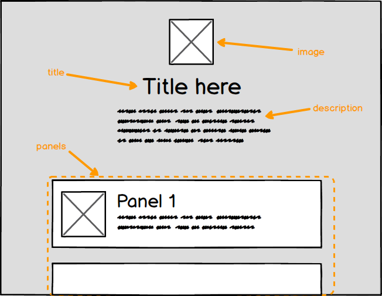

The specification (aka _spec_) is used to define your UI. This includes:

* The UI structure and layout.
* User input field validation settings.
* What contract methods to call.

We recommend storing your spec as a `.json` file in the same folder as your smart contracts.

Full example specs can be viewed via the [CLI](../../CommandLine).

## Structure

The general structure of a spec is as follows:

```js
{
  "version": ...,
  "id": "...",
  "title": "...",
  "description": "...",
  "image": { ... },
  "groups": [ ... ]
}
```

## Reference

**version**

The spec version must always be 1. In future we may introduce non-backwards compatible changes which will require a change to this number.

Example:

```js
{
  "version": 1,
}
```

**id**

This should be a human-readable and identifier for your spec, e.g. `erc20-manager`. The supported characters are: `A-Z`, `a-z`, `0-9` and `-`. It must be between 3 and 32 characters in length.

If you decide to publish your spec to the solUI repository then this id will also need to be unique relative to other already published specs.

Example:

```js
{
  "id": "erc20-token-ui",
}
```

**title**

A user-friendly title for your UI.  It must be between 3 and 256 characters in length.

Example:

```js
{
  "title": "Create and manage ERC-20 tokens",
}
```

**description** _(optional)_

A user-friendly text-only description for your UI. There is no character limit.

Example:

```js
{
  "description": "This interface is for creating and managing your own ERC-20 tokens."
}
```

**image** _(optional)_

An image which appears to display alongside the UI title.

```js
{
  "image": {
    "url": "https://url.to/logo.png"
  }
}
```

Base-64 `data:` URLs are also supported:

```js
{
  "image": {
    "url": "data:image/gif;base64,R0lGO..."
  }
}
```

**groups**

Interface [groups](../Groups) which define the actual layout.

```js
{
  "groups": [
    { ... },
    { ... },
    ...
  ]
}
```
